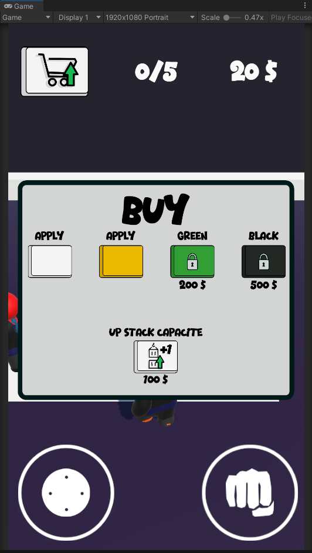
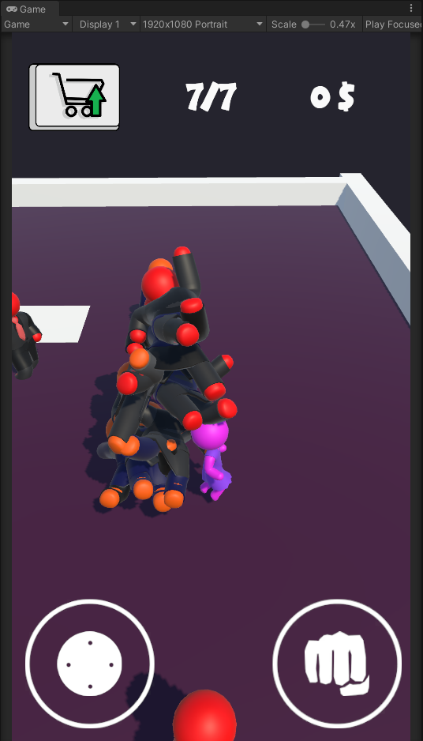

# HyperCasual 67Bits Test

Este projeto é um jogo HyperCasual desenvolvido para o teste da 67 Bits. O objetivo do jogo é controlar um personagem que coleta inimigos para formar uma pilha, ao mesmo tempo em que permite a personalização do jogador através de uma loja.

## Funcionalidades

- **Controle do Jogador**: Controle o personagem principal, movimentando-o pelo cenário e coletando inimigos que são empilhados para gerar pontuações ou efeitos adicionais.
- **Mecânica de Coleta**: O jogador pode interagir com os inimigos, adicionando-os a uma pilha, o que aumenta sua pontuação ou desbloqueia novas cores.
- **Loja de Personalização**: Personalize o jogador com diferentes cores e itens que podem ser adquiridos na loja, melhorando a aparência e, potencialmente, habilidades.

## Estrutura de Scripts

### PlayerController
O script `PlayerController` gerencia a movimentação do jogador e a interação com os inimigos. Ele contém a lógica para o controle do personagem e para a coleta dos inimigos, adicionando-os à pilha.

```csharp
public class PlayerController : MonoBehaviour
{
    // Implementação do controle do jogador e coleta de inimigos
}
```

### ShopManager
O script `ShopManager` gerencia as funcionalidades da loja, incluindo a compra de personalizações e a aplicação delas ao jogador. Ele controla o inventário de itens e as opções de customização disponíveis.

```csharp
public class ShopManager : MonoBehaviour
{
    // Implementação da loja e aplicação de personalizações
}
```

## Imagens

### Loja
Exemplo da tela de personalização onde o jogador pode adquirir cores e mudar a aparência do personagem além de pode fazer upgrades na sua pilha.



### Pilha de Inimigos
Imagem da mecânica de empilhamento de inimigos, mostrando o jogador após coletar alguns deles.



## Como Executar

1. Clone o repositório:
   ```bash
   git clone https://github.com/Dilumo/HyperCasual_67Bits_Test
   ```
2. Abra o projeto no Unity versão 2023.1.15f1.
3. Carregue a cena principal do jogo e execute-a para iniciar a gameplay.

## Tecnologias Utilizadas

- **Unity**: Motor de jogo utilizado para o desenvolvimento e montagem do ambiente.
- **C#**: Linguagem de programação usada para escrever os scripts e gerenciar as mecânicas do jogo.

## Licença

Este projeto está licenciado sob a licença MIT. Consulte o arquivo [LICENSE](LICENSE) para mais detalhes.
